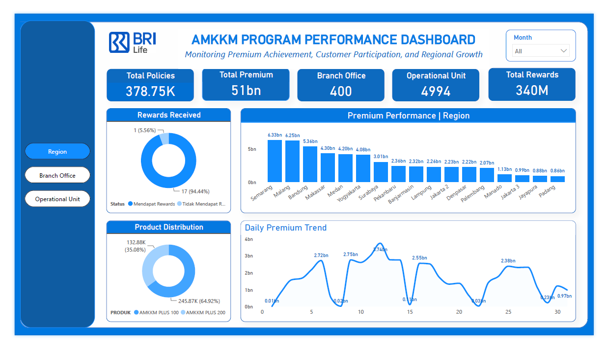
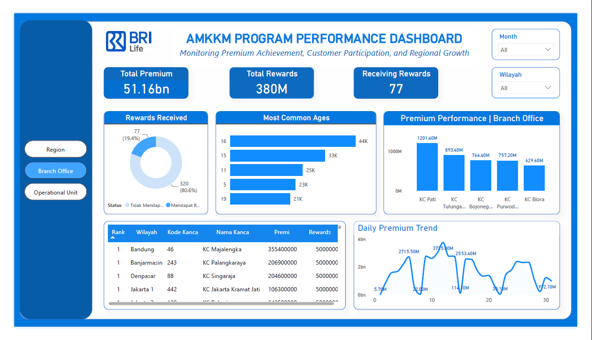
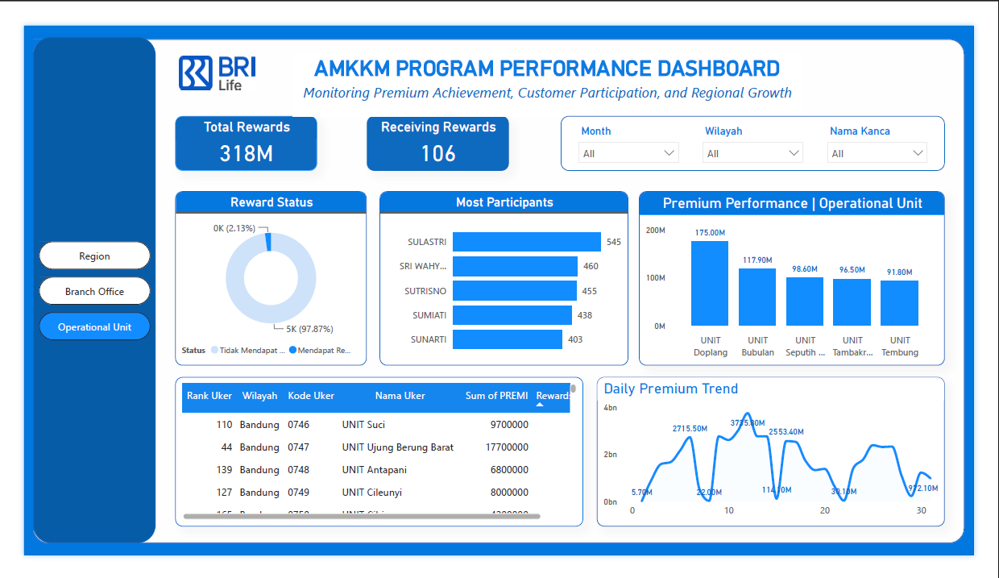
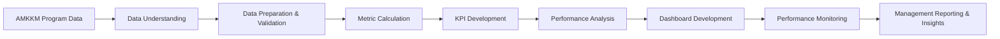

<div align="center">

# AMKKM Program Performance Dashboard


<br/>

### Interactive Power BI dashboard for monitoring premium achievement, customer participation, product distribution, reward performance, and regional growth across the AMKKM program.

<br/>


<br/><br/>

[Overview](#-overview) •
[Objectives](#-project-objectives) •
[Dashboard](#-dashboard-sections) •
[Tech Stack](#️-tech-stack) •
[Workflow](#-project-workflow) •
[My Role](#-my-role) •
[Internship](#-internship-information)

</div>

---

## 📌 Overview

**AMKKM Program Performance Dashboard** is an interactive business intelligence dashboard developed during my internship as a **Business Analyst Intern — Bancassurance Strategy Division at PT Asuransi BRI Life**.

The dashboard was developed to monitor AMKKM program performance across **400 branch offices and 4,994 operational units**, providing stakeholders with a centralized view of premium achievement, customer participation, product distribution, reward performance, and regional growth.

The project transforms operational and program performance data into structured and interactive visual insights to support **performance evaluation, monitoring, reporting, and data-driven decision-making**.

The dashboard was developed using **Microsoft Power BI** and provides multi-level performance analysis across:

**Region → Branch Office → Operational Unit**

---

## 🎯 Project Objectives

The main objectives of this project were to:

- Monitor overall AMKKM program performance.
- Track premium achievement across regions, branch offices, and operational units.
- Monitor policy and customer participation.
- Analyze daily premium performance trends.
- Compare premium contributions across organizational levels.
- Monitor AMKKM product distribution.
- Evaluate reward achievement and reward status.
- Identify high-performing regions, branch offices, and operational units.
- Provide interactive filtering for more detailed performance analysis.
- Support recurring performance evaluation and management reporting.
- Transform operational data into actionable business insights.

---

## 📊 Key Performance Indicators

The dashboard provides high-level indicators for monitoring AMKKM program performance.

| KPI | Value / Scope |
|---|---:|
| **Total Policies** | **378.75K** |
| **Total Premium** | **~51B** |
| **Branch Offices** | **400** |
| **Operational Units** | **4,994** |
| **Product Distribution** | AMKKM Plus 100 & AMKKM Plus 200 |
| **Reward Monitoring** | Region, Branch Office & Operational Unit |

These indicators provide stakeholders with an immediate overview of the scale and performance of the AMKKM program.

---

## 📊 Dashboard Sections

The dashboard is structured into three levels of analysis:

### 1. Region Performance

The **Region Performance** page provides a high-level overview of AMKKM performance across different regions.

#### Key Metrics

- Total Policies
- Total Premium
- Number of Branch Offices
- Number of Operational Units
- Total Rewards

#### Analysis

- Premium Performance by Region
- Daily Premium Trend
- Reward Achievement
- Product Distribution
- Regional Contribution
- Monthly Performance Monitoring

The regional view enables stakeholders to compare premium contribution and program performance across geographic areas.

<p align="center">
  
</p>

---

### 2. Branch Office Performance

The **Branch Office Performance** page provides more detailed monitoring of AMKKM performance at the branch office level.

#### Key Metrics

- Total Premium
- Total Rewards
- Branch Offices Receiving Rewards

#### Analysis

- Premium Performance by Branch Office
- Daily Premium Trend
- Reward Status
- Branch Office Ranking
- Premium Achievement
- Participant Characteristics
- Reward Achievement

Interactive filters allow performance to be analyzed based on region and reporting period.

<p align="center">
  
</p>

---

### 3. Operational Unit Performance

The **Operational Unit Performance** page provides detailed analysis at the lowest organizational monitoring level.

#### Key Metrics

- Total Rewards
- Operational Units Receiving Rewards

#### Analysis

- Premium Performance by Operational Unit
- Daily Premium Trend
- Reward Status
- Operational Unit Ranking
- Participant Performance
- Top Participants
- Premium Achievement

Interactive filters allow users to analyze operational unit performance based on:

- Month
- Region
- Branch Office

<p align="center">
  
</p>

---

## 🔍 Key Analysis Areas

### Premium Performance

Evaluates premium achievement across different organizational levels and identifies areas contributing most significantly to overall program performance.

### Regional Performance

Compares premium performance across regions to identify geographic differences and high-performing areas.

### Branch Office Performance

Provides detailed monitoring of premium achievement and reward performance across individual branch offices.

### Operational Unit Performance

Enables granular monitoring of operational units and identifies units with strong premium and participant performance.

### Customer Participation

Monitors policy participation and participant activity to provide insights into AMKKM program engagement.

### Product Distribution

Analyzes the distribution of AMKKM products, including:

- AMKKM Plus 100
- AMKKM Plus 200

### Reward Performance

Monitors reward eligibility and achievement across regions, branch offices, and operational units.

### Premium Trend Analysis

Tracks daily premium trends to identify changes, peaks, and fluctuations in program performance over time.

---

## 🛠️ Tech Stack

<div align="center">


</div>

| Technology | Usage |
|---|---|
| **Microsoft Power BI** | Interactive dashboard development, KPI visualization, performance monitoring, filtering, drill-down analysis, and management reporting |

---

## 🔄 Project Workflow

The project followed an end-to-end business analytics workflow:



---

### 1. Data Understanding

The program data was reviewed to understand key dimensions and performance indicators required for AMKKM monitoring.

The analysis focused on information related to:

- Policies
- Premium
- Region
- Branch Office
- Operational Unit
- Product
- Customer Participation
- Rewards
- Reporting Period

---

### 2. Data Preparation & Validation

The data was prepared and validated to ensure it could be used consistently for performance reporting.

The process included:

- Data validation
- Data consistency checking
- Data transformation
- Organizational hierarchy structuring
- Metric preparation
- Dataset preparation for dashboard visualization

---

### 3. KPI Development

Relevant performance indicators were developed to monitor AMKKM program performance.

The primary KPIs included:

- Total Policies
- Total Premium
- Branch Office Coverage
- Operational Unit Coverage
- Reward Achievement
- Product Distribution
- Premium Contribution

---

### 4. Performance Analysis

The AMKKM program was analyzed across multiple organizational levels:

**Region → Branch Office → Operational Unit**

The analysis focused on:

- Premium achievement
- Regional contribution
- Branch performance
- Operational unit performance
- Customer participation
- Reward achievement
- Product distribution
- Daily premium trends

---

### 5. Dashboard Development

The analytical metrics were transformed into an interactive **Power BI dashboard**.

The dashboard incorporates:

- KPI Cards
- Bar Charts
- Donut Charts
- Line Charts
- Ranking Tables
- Interactive Filters
- Multi-level Navigation
- Time-Based Filtering

---

### 6. Performance Monitoring & Reporting

The dashboard provides a centralized reporting interface that enables stakeholders to:

- Monitor overall AMKKM performance.
- Compare performance across regions.
- Identify high-performing branch offices.
- Analyze operational unit performance.
- Track premium changes over time.
- Monitor reward achievement.
- Evaluate product distribution.
- Support periodic program performance reporting.

---

## 💡 Dashboard Capabilities

The dashboard enables stakeholders to:

- Monitor AMKKM premium performance from a centralized interface.
- Analyze performance across 400 branch offices.
- Monitor 4,994 operational units.
- Compare premium contribution across regions.
- Drill down from regional to operational unit performance.
- Track daily premium trends.
- Monitor policy participation.
- Analyze AMKKM product distribution.
- Evaluate reward achievement.
- Identify high-performing organizational units.
- Apply interactive filters for targeted analysis.
- Support management reporting and performance evaluation.

---

## 👨‍💻 My Role

As a **Business Analyst Intern in the Bancassurance Strategy Division at PT Asuransi BRI Life**, I developed the **AMKKM Program Performance Dashboard** to support monitoring and evaluation of nationwide program performance.

My contributions included:

- Understanding AMKKM program reporting requirements.
- Preparing and validating program performance data.
- Structuring data across region, branch office, and operational unit levels.
- Developing key performance indicators.
- Analyzing premium achievement.
- Monitoring customer and policy participation.
- Analyzing AMKKM product distribution.
- Evaluating reward performance.
- Comparing performance across organizational levels.
- Monitoring daily premium trends.
- Designing interactive dashboard layouts.
- Developing performance visualizations using Microsoft Power BI.
- Implementing filters and multi-level dashboard navigation.
- Supporting performance evaluation and reporting through data-driven insights.

---

## 🧠 Skills Applied

This project demonstrates practical experience in:

- Business Analysis
- Data Analytics
- Business Intelligence
- Performance Monitoring
- Dashboard Development
- KPI Development
- Data Visualization
- Data Validation
- Bancassurance Analytics
- Premium Performance Analysis
- Customer Participation Analysis
- Product Performance Analysis
- Reward Performance Analysis
- Regional Performance Analysis
- Management Reporting
- Data-Driven Decision Support
- Microsoft Power BI

---

## 💼 Internship Information

| Information | Details |
|---|---|
| **Role** | Business Analyst Intern |
| **Division** | Bancassurance Strategy Division |
| **Company** | PT Asuransi BRI Life |
| **Project** | AMKKM Program Performance Dashboard |
| **Tool** | Microsoft Power BI |
| **Coverage** | 400 Branch Offices & 4,994 Operational Units |
| **Focus Areas** | Business Analysis, Performance Monitoring, Data Analytics, Business Intelligence, Bancassurance Analytics |

---

## 📂 Repository Structure

```text
brilife-business-analyst/
│
├── README.md
│
└── assets/
    ├── amkkm-program-performance-dashboard.png
    ├── amkkm-region-performance.png
    ├── amkkm-branch-office-performance.png
    └── amkkm-operational-unit-performance.png
```

| File | Description |
|---|---|
| `README.md` | Main project documentation |
| `amkkm-program-performance-dashboard.png` | Main dashboard preview |
| `amkkm-region-performance.png` | Region-level performance dashboard |
| `amkkm-branch-office-performance.png` | Branch office performance dashboard |
| `amkkm-operational-unit-performance.png` | Operational unit performance dashboard |

---

## 🔐 Data Confidentiality

The original dataset and interactive dashboard used in this project are **not publicly shared** because they contain internal and proprietary information related to PT Asuransi BRI Life and the AMKKM program.

This repository is intended only to showcase the:

- Analytical approach
- Dashboard design
- KPI framework
- Performance monitoring structure
- Business intelligence workflow
- Technical implementation

without exposing confidential company data or internal business information.

---

<div align="center">

## AMKKM Program Performance Dashboard

**Business Analyst Internship Project**  
**Bancassurance Strategy Division — PT Asuransi BRI Life**

`Power BI` • `Business Analysis` • `Data Analytics` • `Business Intelligence` • `Bancassurance`

<br/>

> **“Transforming program performance data into actionable insights for better monitoring and strategic decision-making.”**

</div>
